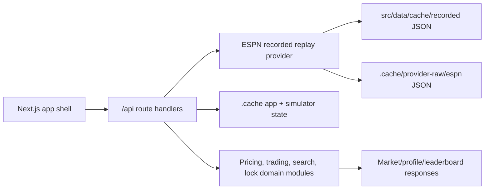
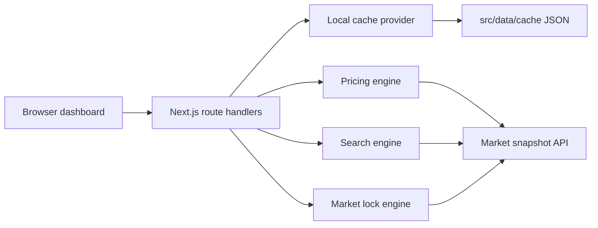
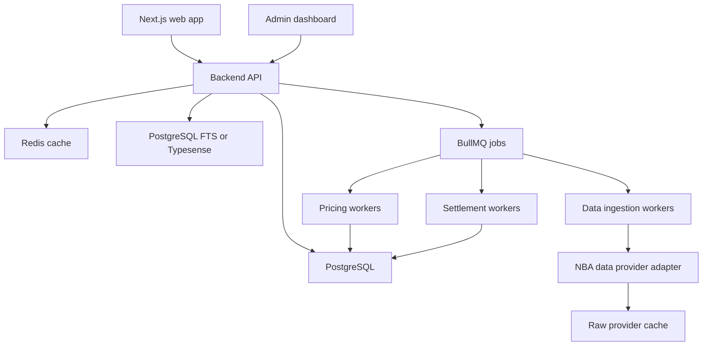

# Architecture

## Recommendation

Use a TypeScript-first web stack for the production MVP. The repo now starts that migration with a Next.js app shell and route handlers, while the domain modules remain framework-independent.

| Layer | MVP Recommendation | Reason |
| --- | --- | --- |
| Frontend | React or Next.js with TypeScript | Strong UI ecosystem for dense analytics, tables, and charts |
| Backend | Node.js with NestJS or Express | Shared TypeScript models with frontend, good job and API ecosystem |
| Database | PostgreSQL | Relational contest, transaction, settlement, and audit data |
| Cache | Redis | Lock state, computed leaderboard snapshots, hot market reads |
| Jobs | BullMQ | Ingestion, projection refresh, settlement, leaderboard rebuilds |
| Search | PostgreSQL full-text first | Avoid extra infrastructure until search scale demands it |
| Data provider | Provider abstraction | Allows local fixtures, nba_api, BALLDONTLIE, or paid providers later |

This repository started with a dependency-free prototype so the domain rules could be tested locally before framework decisions added weight. The current implementation uses Next.js for the app/API boundary and keeps persistence/data providers swappable.

## Current Next.js Development Stack

## Cache-First Development Architecture

## Future Production Architecture

## Boundaries

| Boundary | Responsibility |
| --- | --- |
| Data provider | Fetch or read source data, normalize into Hoopfolio shape |
| Pricing engine | Fantasy scoring, projections, result stock values, caps, explanations |
| Transaction engine | Validate balance, shares, concentration, idempotency, market lock |
| Market lock engine | Server-side daily/weekly lock status |
| Settlement engine | Final weekly holdings, realized/unrealized value, leaderboard snapshots |
| Boost engine | Loyalty eligibility, discount, cap, decay, settlement explanation |
| Search engine | Filters, sorting, presets, discovery sections |
| Persistence adapter | Users, sessions, contests, portfolios, holdings, transactions, and leaderboard snapshots |

## Early Data Model

| Entity | Purpose |
| --- | --- |
| users | Authentication identity |
| contests | Weekly global contest windows |
| contest_entries | User participation in a contest |
| nba_teams | Neutral team metadata |
| nba_players | Player identity, position, status |
| games | Eligible NBA schedule |
| player_game_stats | Raw fantasy scoring inputs by game |
| player_weekly_projections | Expected weekly fantasy points and inputs |
| player_weekly_prices | Opening, current, projected, and settled stock values |
| transactions | Buy/sell audit trail |
| holdings | Current contest positions |
| player_loyalty | User-player repeat investment history |
| leaderboards | Finalized leaderboard metadata |
| leaderboard_entries | User ranks and values |
| data_ingestion_runs | Provider/cache ingestion status |
| audit_logs | Admin, transaction, settlement, and correction history |
